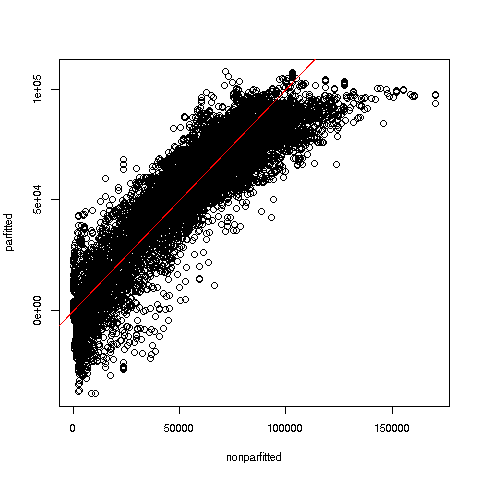

# regtools 

## Novel tools tools for regression, classification and machine learning

Various tools for Prediction and/or Description goals in regression,
classification and machine learning.  

Some of them are associated with my book, <i>From
Linear Models to Machine Learning: Statistical Regression and
Classification</i>, N. Matloff, CRC, 2017 (recipient of the
Eric Ziegel Award for Best Book Reviewed in 2017, *Technometrics*), and
with my forthcoming book, *The Art of Machine Learning: Algorithms+Data+R*,
NSP, 2020 .  But **the tools are useful in general, independently of the
books**.

<font size="3">
<span style="color:red"> 
CLICK [HERE](#quickstart) for a **regtools** Quick Start!
</span>
</font>

## FEATURES

* Advanced tool for tuning-parameter grid search, including plotting,
  Bonferroni intervals and smoothing.

* Innovative graphical tools for assessing fit in linear and nonlinear
  parametric models, via nonparametric methods.  Model evaluation,
examination of quadratic effects, investigation of nonhomogeneity of
variance.

* Tools for multiclass classification to extend functions that only handle the
  binary case, e.g. *glm()*.  One vs. All and All vs. All paradigms.  

* Novel adjustment for imbalanced data.

* K-NN regression for general dimensions in predictor and
  response variables, using k-Nearest Neighbors (k-NN).  Local-linear
option to deal with edge aliasing.  Allows for user-specified smoothing
method.  Allows for accelerated exploration of multiple values of **k**
at once.  Capability to give different variables different weights in
the distance computation.

* Extension to nonlinear parametric regression of Eicker-White
technique to handle heteroscedasticity.

* Utilities for conversion of time series data to rectangular form,
  enabling lagged prediction by **lm()** or other regression model.

* Utilities for conversion between factor and dummy variable forms,
  useful since among various regression packages, some use factors while
some others use dummies.  (The **glmnet** package is an example of the
latter case.)

* Misc. tools, e.g. to reverse the effects of an earlier call to
  **scale()**.

* Nicer implementation of ridge regression, with more meaningful scaling
and better plotting.

* Linear regression, PCA and log-linear model estimation in missing-data
setting, via the Available Cases method.  (For handling missing values
in Prediction contexts, see
[our toweranNA package](http://github.com/matloff/toweranNA).)

* Interesting datasets.

A number of examples of use follow below.

## OVERVIEW: FUNCTION CATEGORIES

See full function list by typing

``` r
> ?regtools
``` 

Here are the main categories:

- Parametric modeling
- Diagnostic plots
- Classification
- Machine learning
- Dummies and R factors
- Statistics
- Matrix
- Time series
- Image processing 
- Text processing
- Recommender systems
- Misc.

## <a name="quickstart">REGTOOLS QUICK START </a> 

Here we will take a quick tour of a subset of **regtools** features,
using a dataset **prgeng** that is included in the package.  We'll start
with linear regression, briefly illustrating **regtools**'s novel
diagnostic tools, then move on the use of machine learning methods on
this data, again using the data to illustrate various features of
**regtools**.

### The Data

The dataset consists of data on Silicon Valley programmers and engineers
in the 2000 US Census.  It is available in several forms.  We'll use the
data frame version, and use only a few features to keep things simple:

``` r
> data(peFactors)
> names(peFactors)
 [1] "age"      "cit"      "educ"     "engl"     "occ"      "birth"   
 [7] "sex"      "wageinc"  "wkswrkd"  "yrentry"  "powspuma"
> pef <- peFactors[,c(1,3,5,7:9)]
> head(pef)
       age educ occ sex wageinc wkswrkd
1 50.30082   13 102   2   75000      52
2 41.10139    9 101   1   12300      20
3 24.67374    9 102   2   15400      52
4 50.19951   11 100   1       0      52
5 51.18112   11 100   2     160       1
6 57.70413   11 100   1       0       0
```

The various education and occupation codes may be obtained from the
reference in the help page for this dataset.

We'll predict wage income.  One cannot get really good accuracy with the
given features, but this dataset will serve as a good introduction to
these particular features of the package.

The **qe\*()** functions' output are ready for making prediction on new cases.
We'll use this example:

``` r
> newx <- data.frame(age=32, educ='13', occ='106', sex='1', wkswrkd=30)
```

### The qe*() series of regtools wrappers for machine learning functions

One of the features of **regtools** is its **qe\*()** functions, a set
of wrappers.  Here 'qe' stands for "quick and easy."  These functions
provide convenient access to more sophisticated functions, with a *very
simple*, uniform interface.  For example,  **qeRF()** is a wrapper for
the **randomForest()** function in the well-known package of the same
name.

Note that the simplicity of the interface is just as important as the
uniformity. To run a neural networks fit to our **pef** data above, we
simply call

``` r
qeNeural(pef,'wageinc')
```

with no preparation code, e.g. no defining a model.  Default values are
used for hyperparameters, but the user can easily explore other values,
e.g.

``` r
qeNeural(pef,'wageinc',hidden=c(100,100)))
```


Each function does the model fit, with an optional holdout evaluation,
with output ready for prediction of new cases via the R generic
**predict()**, .e.g. **predict.RF()**.  

As noted, these functions are largely convenience wrappers.
But they do substantially more than the functions they wrap:

* They automatically assesses the model on a holdout set, using as loss
  Mean Absolute Prediction Error or Overall Misclassification Rate.

* They handle R factors correctly in prediction, which some of the
  wrapped functions do not do by themselves (see below).

Call form for all **qe\*()** functions:

``` r
qe*(data,yName, options incl. method-specific)
```

Currently available:

* **qeLin()** linear model, wrapper for **lm()** 

* **qeLogit()** logistic model, wrapper for **glm(family=binomial)**

* **qeKNN()** k-Nearest Neighbors, wrapper for **regtools** **kNN()**

* **qeRF()** random forests, wrapper for **randomForest** package

* **qeGBoost()** gradient boosting on trees, wrapper for **gbm** package

* **qeSVM()** SVM, wrapper for **e1071** package

* **qeNeural()** neural networks, wrapper for **regtools** function
**krsFit()**, in turn wrapping **keras** package

So, let's try a few:

### Linear model

``` r
> lmout <- qeLin(pef,'wageinc') 
> lmout$testAcc
[1] 25520.6  # Mean Absolute Prediction Error on holdout set
> predict(lmout,newx)
      11 
35034.63   
```

The **regtools** package includes some novel diagnostic methods for
assessing linear regression models.  One of them plots parametric vs.
k-NN fit:

``` r
> parvsnonparplot(lmout,qeKNN(pef,'wageinc',25))
```

We specified k = 25 nearest neighbors.  Here is the plot:



There is some suggestion here that the linear model tends to
underpredict at low and high wage values.  If the analyst wished to use
a linear model, she would investigate further (always a good idea before
resorting to machine learning algorithms), possibly adding quadratic
terms to the model.

### Random forests

``` r
> rfout <- qeRF(pef,'wageinc')
> rfout$testAcc
[1] 25416.02
```

A bit better than the linear fit, not too surprising in light of what we
saw in the diagnostic graph above.  And remember, we are using the
default values of the hyperparameters; we probably can do even better,
maybe using **regtools**'s advanced grid search (see below).

Now, let's try the prediction:

``` r
> predict(rfout,newx)
      11 
39560.77 
```

Considerably different from what we got with the linear model.  But
there's more:

``` r
> class(rfout)
[1] "qeRF"         "randomForest"
> rfo <- rfout
> class(rfo) <- "randomForest"
> predict(rfo,newx)
Error in predict.randomForest(rfo, newx) : 
  Type of predictors in new data do not match that of the training data.
```

Many packages do not handle prediction of fully new cases correctly, as
we see here.  The **qe\*()** wrappers remedy this.

### Neural networks

Let's do one more.

``` r
nout <- qeNeural(pef,'wageinc')
> nnout$testAcc
[1] 25043.09
> predict(nnout,newx)
[1] 42597.28
```

Ah, better still.  Again, we should try other combinations of
hyperparameters besides the defaults.  The **regtools** function
**fineTuning()** does this in an advanced manner, as seen in the next
section:


## EXAMPLE:  ADVANCED GRID SEARCH

Many statistical/machine learning methods have a number of *tuning
parameters* (or *hyperparameters*).  The idea of a *grid search* is to
try many combinations of candidate values of the tuning parameters to
find the "best" combination, say in the sense of highest rate of correct
classification in a classification problem.

Various machine learning packages include grid search functions.  But as
will be seen below, the one in **regtools** has some novel features not
found in the other packages.

First, though, a brief discussion regardng finding the "best"
hyperparameter combination.

### Which one is really best? ###

**But why the quotation marks around the word *best* above?**  The fact
is that, due to sampling variation, a naive grid search may not give you
the best parameter combination:

1. The full dataset is a sample from some target population.

2. Most grid search functions use *cross-validation*, in which the data
   are (one or more times) split into a training set and a prediction
set, thus adding further sampling variation.

So the parameter combination that seems best in the grid search may not
actually be best.  It may do well just by accident, depending on the
dataset size, the number of cross-validation folds, the number of
features and so on.

In other words:

> Grid search is actually a form of  *p-hacking*.

Thus one should not rely on the "best" combination found by a grid
search. One should consider several combinations that did well.  A good
rule is that if several combinations yield about the same result, one
should NOT necessarily choose the combination with the absolute minimum
loss; one might instead just the one with the smallest standard error,
as it's the one we're most sure of.

### A further caveat

In fact, it is often wrong to even speak of the "best" hyperparameter
combination in the first place. This is because there actually might be
several optimal configurations, due to the fact that the mean loss
sample loss values of different hyperparameters may be correlated (often
negatively).  

### In other words

Just pick a good one, without obsessing too much over "best," and pay
attention to standard errors.

### The **regtools** approach ###

The **regtools** grid search function **fineTuning()** is an advanced
grid search tool, in two ways:

1.  It aims to counter p-hacking, by forming 
[Bonferoni-Dunn confidence intervals]([https://en.wikipedia.org/wiki/Bonferroni_correction)
for the mean losses.

2.  It provides a plotting capability, so that the user can see at a
    glance which *several* combinations of parameters look promising,
thereby providing guidance for further combinations to investigate.

Here is an example using the famous Pima diabetes data (stored in a data
frame **db** in the example below).  This is a binary problem
in which we are predicting presence or absence of the disease.  We'll do
an SVM analysis, using the **ksvm()** function from the **kernlab**
package, with a polynomial kernel.  Our parameters are **d**, the degree
of the polynomial, and **C**, the penalty for each datapoint inside the
margin.

The grid search function **fineTuning()** calls a user-defined function
that fits the user's model on the training data and then predicts on the
test data.

``` r
# user provides a function stating the analysis to run on any parameter
# combination cmbi; here dtrn and dtst are the training and test sets,
# generated by fineTuning()

> pdCall <- function(dtrn,dtst,cmbi) {
   # fit training set
   svmout <- 
      qeSVM(dtrn,'occ',gamma=cmbi$gamma,cost=cmbi$cost,holdout=NULL)
   # predict test set
   preds <- predict(svmout,dtst[,-3])$predClasses
   # find rate of correct classification
   mean(preds != dtst$occ)
}

> ftout <- fineTuning(dataset=pef,pars=list(gamma=c(0.5,1,1.5),cost=c(0.5,1,1.5)),regCall=pdCall,nTst=50,nXval=10)
``` 

And the output:

``` r
> ft$outdf
> ftout$outdf
  gamma cost meanAcc      seAcc    bonfAcc
1   0.5  1.5   0.570 0.03296463 0.09140832
2   1.0  1.0   0.576 0.02061283 0.05715776
3   0.5  0.5   0.582 0.02393510 0.06637014
4   1.5  1.5   0.594 0.02045048 0.05670758
5   1.5  0.5   0.608 0.01936779 0.05370534
6   0.5  1.0   0.608 0.02274496 0.06306999
7   1.5  1.0   0.608 0.02908990 0.08066400
8   1.0  0.5   0.614 0.01550627 0.04299767
9   1.0  1.5   0.626 0.01790096 0.04963796
```

Here is what happened in the **fineTuning()** call:

* We fit SVM models, using **qeSVM()**, which has two SVM-specific
  parameters, **gamma** and **cost**.  (See the documentation for
**e1071::svm()**.)

* We specified the values 0.5, 1 and 1.5 for **gamma**, and the same for
  **cost**.  That means 9 possible combinations.

* The function **fineTuning()** generated those 9 combinations, running
  **qeSVM()** on each one,  

* Running **qeSVM()** is accomplished via the **fineTuning()** argument
  **regCall**, which specifies a user-written function, in this case
**pdCall()**.

* In calling **regCall()**, **fineTuning()** passes the current
  hyperparameter combination, **cmbi**, and the current training and
holdout sets, **dtrn** and **dtst**.  The user-supplied **regCall()**,
in this case **pdCall()** then calls the desired machine learning
function, here **qeSVM()**, and calculates the resulting mean loss.

Technically the best combination is (0.5,1.5), but several gave similar
results, as can be seen by the Bonferroni-Dunn column, which gives radii of
approximate 95% confidence intervals.  A more thorough investigation
would involve a broader range of values for **gamma** and **cost**.

The corresponding plot function, called simply as

``` r
plot(ftout)
```

uses the notion of *parallel coordinates*.  The plot, not shown here,
has three vertical axes, represent **gamma**, **cost** and **meanAcc**
from the above output.  Each polygonal line represents one row from
**outdf** above, connecting the values of the three variables.  

This kind of plot is most useful when we have several hyperparameters,
not just 2 as in the current setting.  It allows one to see at a glance
which hyperparameter combinations.


## EXAMPLE:  PARAMETRIC MODEL FIT ASSESSMENT

The fit assessment techniques in **regtools** gauge the fit of
parametric models by comparing to nonparametric ones.  Since the latter
are free of model bias, they are very useful in assessing the parametric
models.

We saw above an example of one such function, **parvsnonparplot()**.
Another is **nonparvarplot()**.  Here is the data prep:

``` r
data(peDumms)
pe1 <- peDumms[c('age','educ.14','educ.16','sex.1','wageinc','wkswrkd')]
lmout <- lm(wageinc ~ .,data=pe1)
```

We will check the classical assumption of homoscedasticity,
meaning that the conditional variance of Y given X is constant.  The
function <b>nonparvarplot()</b> plots the estimated conditional variance
against the estimated conditional mean, both computed nonparametrically:


Though we ran the plot thinking of the homoscedasticity assumption, and
indeed we do see larger variance at large mean values, this
is much more remarkable, showing that there are interesting
subpopulations within this data.  These may correspond to different
occupations, something to be investigated.

The package includes various other graphical diagnostic functions.

By the way, violation of the homoscedasticity assumption won't
invalidate the estimates in our linear model.  They still will be
*statistically consistent*.  But the standard errors we compute, and
thus the statistical inference we perform, will be affected.  This is
correctible using the Eicker-White procedure, which for linear models is
available in the **car** and **sandwich** packages.  Our package here
also extends this to nonlinear parametric models, in our function
<b>nlshc()</b> (the validity of this extension is shown in the book).

## EXAMPLE:  ADJUSTMENT OF CLASS PROBABILITIES IN CLASSIFICATION PROBLEMS

The **LetterRecognition** dataset in the **mlbench** package lists
various geometric measurements of capital English letters, thus another
image recognition problem.  One problem is that the frequencies of the
letters in the dataset are not similar to those in actual English texts.
The correct frequencies are given in the **ltrfreqs** dataset included
here in the **regtools** package.

We can adjust the analysis accordingly, using the **classadjust()**
function.

## EXAMPLE:  RECTANGULARIZATION OF TIME SERIES

This allows use of ordinary tools like **lm()** for prediction in time
series data.  Since the goal here is prediction rather than inference,
an informal model can be quite effective, as well as convenient.
Note that we can also use the machine learning functions.

The basic idea is that **x[i]** is predicted by
**x[i-lg],
x[i-lg+1],
x[i-lg+2],
i...
x[i-1]**, 
where **lg** is the lag.

``` r
> xy <- TStoX(Nile,5)
> head(xy)
#      [,1] [,2] [,3] [,4] [,5] [,6]
# [1,] 1120 1160  963 1210 1160 1160
# [2,] 1160  963 1210 1160 1160  813
# [3,]  963 1210 1160 1160  813 1230
# [4,] 1210 1160 1160  813 1230 1370
# [5,] 1160 1160  813 1230 1370 1140
# [6,] 1160  813 1230 1370 1140  995
> head(Nile,36)
#  [1] 1120 1160  963 1210 1160 1160  813 1230 1370 1140  995  935 1110  994 1020
# [16]  960 1180  799  958 1140 1100 1210 1150 1250 1260 1220 1030 1100  774  840
# [31]  874  694  940  833  701  916
```

Try **qeLin()**.  We'll need to convert to data frame form for this:

``` r
> xyd <- data.frame(xy)  # col names now X1,...,X6
> lmout <- qeLin(xyd,'X6') 
> lmout
> lmout
...
Coefficients:
(Intercept)           X1           X2           X3           X4           X5  
  307.84354      0.08833     -0.02009      0.08385      0.13171      0.37160  
```

Only the most recent observation, X6, seems to have much impact.  We
essentially have an ARMA-1 model, possibly ARMA-2.

Actually, the results here are quite similar to those of the "real" ARMA
function:

``` r
> arma(Nile,c(5,0))

Coefficient(s):
      ar1        ar2        ar3        ar4        ar5  intercept  
  0.37145    0.13171    0.08391   -0.01992    0.08839  307.69318  
```

Predict the 101st observation:

``` r
> predict(lmout,xyd[95,-6])
      95 
810.3493 
```

Let's try a nonparametric approach, using random forests:

``` r
> rfout <- qeRF(xyd,'X6')
> predict(rfout,xyd[95,-6])
      95 
812.1225 
```

