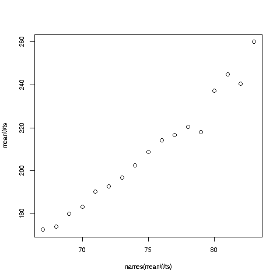
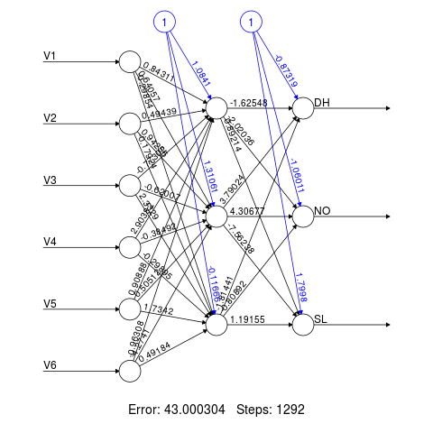
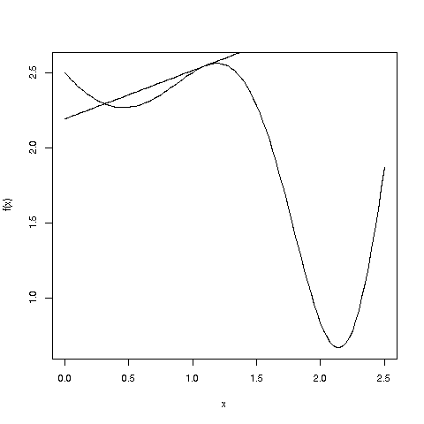

#  The 10-Page Machine Learning Book

(The title here alludes to Andriy Burkov's excellent work,
*The Hundred-Page Machine Learning Book*.  Note too my own 
forthcoming book, *The Art of Machine Learning: Algorithms+Data+R*.)

Here we give an overview of the most widely used predictive methods in
statistical/machine learning (ML).  For each one, we present

* background

* overview of how it works

* function in the R package, **qeML** (readers without R background or
  who simply wish to acquire an overview of ML may skip the R code
without loss of comprehehnsion of the text).

We'll also discuss the overfitting issue.

## Notation

For convenience, we'll let Y denote the variable to be predicted, i.e.
the response variable, and let X denote the set of predictor
variables/features.  (ML people tend to use the term *features*,
while In stat, the term *predictors* is common.  In applied fields, e.g.
economics or psychology, some use the term *independent variables*.)

We develop our prediction rule from available 
*training data*, consisting of n data points, denoted by
(X<sub>1</sub>, Y<sub>1</sub>),.., (X<sub>n</sub>,
Y<sub>n</sub>).  We wish to predict new cases
(X<sub>new</sub>,Y<sub>new</sub>) in the future, in which X<sub>new</sub>
is known but Y<sub>new</sub> needs to be predicted.

So, we may wish to predict human weight Y from height X, or from height
and weight in the 2-component vector X.  
Say we have the latter situation, and data on n = 100 people.  Then for
instance X<sub>23</sub> would be the vector of height and age for the
23rd person in our training data, and Y<sub>23</sub> would be that
person's weight.

The vector X may include *indicator* variables, which have values only 1
or 0.  We may for instance predict weight from height, age and gender,
the latter being 1 for female, 0 for male.

If Y represents a binary variable, we represent it as an indicator
variable.  In the famous Pima Diabetes dataset in the
[UCI Machine Learning
Repository](https://archive.ics.uci.edu/ml/index.php), 1 means diabetic,
0 means not.

If Y is categorical, we represent it by several indicator variables, one for
each category.  In another disease-related UCI dataset (to be discussed
below), Y is status of a person's vertebrae condition; there are 2
disease types, and normal, for a total of 3 categories.  Y = (0,0,1)
for a normal person, for instance.  Thus Y can be a vector too.

## Running example

The package's built-in dataset **mlb** consists of data on major league
baseball players (courtesy of the UCLA Dept. of Statistics).

Here is a glimpse of the data:

``` r
> data(mlb)
> head(mlb)
             Name Team       Position Height Weight   Age PosCategory
1   Adam_Donachie  BAL        Catcher     74    180 22.99     Catcher
2       Paul_Bako  BAL        Catcher     74    215 34.69     Catcher
3 Ramon_Hernandez  BAL        Catcher     72    210 30.78     Catcher
4    Kevin_Millar  BAL  First_Baseman     72    210 35.43   Infielder
5     Chris_Gomez  BAL  First_Baseman     73    188 35.71   Infielder
6   Brian_Roberts  BAL Second_Baseman     69    176 29.39   Infielder
```

## The  R package's **qe***-series functions

Here "qe" stands for **"quick and easy."**  The functions have a simple,
uniform interface, and most importantly, **require no setup.**  To fit
an SVM model, say, one simply calls **qeSVM()**, no preparation calls to
define the model etc.

The call form is

``` r
model fit <- qe<model name>(<data name>,<Y name>)
```

As noted, no prior calls are needed to define the model, etc.

## Example

Let's predict weight from height and age, using two methods, k-Nearest
Neighbor and random forests.

``` r
mlb <- mlb[,4:6]  # columns for height, weight and age
knnout <- qeKNN(mlb,'Weight')  # fit k-Nearest Neighbor model
rfout <- qeRF(mlb,'Weight')  # fit random forests model
```

Default values of hyperparameters are used but can be overridden.
Prediction of new cases is equally easy, in the form

``` r
predict(<model fit>, <new X value>)
```

E.g. to predict the weight of a new player of height 70 and age 28, run

``` r
> predict(rfout,c(70,28))
       2 
184.1626 
```

The model is automatically assessed on a holdout set (the concept is
discussed later in this document):

``` r
> rfout$testAcc  # mean absolute prediction error
[1] 15.16911
```

(The formation of a holdout set can be suppressed.)

## Regression and classification problems, regression functions

Prediction applications in which Y is a continuous variable, say weight,
or at least ordinal, are called *regression settings*.  Applications in
which Y is categorical, i.e. Y is a factor variable in R, say predicting
the player's position (e.g. pitcher) are *classification settings*.

Somewhat confusingly, both settings make use of the *regression function*,
m(t) = E(Y | X = t), the mean value of Y in the subpopulation defined by
X = t.  If say we are predicting weight in the **mlb** data, then for instance
m(71,23) would be the mean weight among all players of height 71 inches
and 23 years old.  To predict the weight of a new player, say height 77
and age 19, we use m(77,19).

In classification problems, Y is converted to a set of indicator
variables.  For the position 'pitcher' in the **mlb** data, we would have
Y = 1 or 0, depending on whether the player is a pitcher or not.
(Position is in column 3 of the original dataset.)
Then  E(Y | X = t) reduces to P(Y = 1 | X = t), the probability that the
player is a pitcher given the player's height, weight and age, say.  We
would typically find probabilities for each position, then guess the one
with the highest probability.

In other words, the regression function m(t) is central to both regression
and classification settings.  The statistical/machine learning methods
presented here amount to ways to estimate m(t).  The methods are
presented below in an order that shows connection between them.

Even though each ML method has its own special *tuning parameters* or
*hyperparameters*, used to fine-tune performance, they all center around
the regression function m(t).

The **qe** series function sense whether the user is specifying a
regression setting or a classification setting, by noting whether the Y
variable (second argument) is numeric or an R factor.

## ML predictive methods

We now present the "30,000 foot" view of the major statistical/machine
learning methods.

### k-Nearest Neighbors

This method was originally developed by statisticians, starting in the 1950s
and 60s.

It's very intuitive.  To predict, say, the weight of a new
player of height 72 and age 25, we find the k closest players in our 
training data to (72,25), and average their weights.  This is our
estimate of m(72,25), and we use it as our prediction.

The **qeKNN()** function wraps **kNN()** in **regtools**.  The main
hyperparameter is the number of neighbors k.  As with any
hyperparameter, the user aims to set a "Goldilocks" level, not too big,
not too small.  Setting k too small will result in our taking the
average of just a few Y values, too small a sample.  On the other hand,
too large a value for k will some distant data points may be used that
are not representative.

### Random forests

This method was developed mainly by statisticians, starting in the
1980s.

This is a natural extension of k-NN, in that it too creates a
neighborhood and averages Y values within the neighborhood.  However, it
does so in a different way, creating tree structures.

Say we are predicting blood pressure from height, weight and age.  We
first ask whether the height is above or below a certain threshold.
After that, we ask whether weight is above or below a certain
(different) threshold.  This partitions height-weight space into 4
sectors.  We then might subdivide each sector according to whether age
is above or below a threshold, now creating 8 sectors of
height-weight-age space.  Each sector is now a "neighborhood."  To
predict a new case, we see which neighborhood it belongs to, then take
our prediction to be the average Y value among training set points in
that neighborhood.

The word *might* in the above paragraph alludes to the fact that the
process may stop early, if the current subdivision is judged fine enough
to produce good accuracy.  And one generally wants to avoid having
neighborhoods (*nodes* in the tree) that don't have many data points;
this is controlled by a hyperparameter, say setting a minimum number of
data points per node; if a split would violate that rule, then don't
split.  Of course, if we set out threshold too high, we won't do enough
splits, so again we need to try to find a "Goldilocks" level.

Here is an example using the UCI Vertebrae dataset.  There are 6
predictor variables, named V1 through V6 consisting of various bone
measurements.  There are 3 classes, DH (Disk Hernia), Spondylolisthesis
(SL), Normal (NO).  A single tree is shown.


At the root, if the predictor variable V6 in our new case to be
predicted is < 16, we go left, otherwise right.  Say we go left.
Then if V4 < 28 in the new case, we go left again, getting to a leaf, in
which we guess DH.  The 0.74 etc. mean that for the training data that
happen to fall into that leaf, 74% of them are in class DH, 26% are NO
and 0% are SL.  So we gues DH.

Clearly, the order in which the predictor variables are evaluated (e.g.
height, weight and age in the **mlb** data) can matter a lot.  So, more
than one tree is constructed, with random orders.  The number of trees
is another hyperparameter.  Each tree gives us a prediction for the
unknown Y.  In a regression setting, those predictions are averaged to
get our final prediction.  In a classification setting, we see which
class was predicted most often among all those trees.

The thresholds used at each node are determined through a complicated
process, depending on which implemented of RF one uses.

The **qeRF()** function wraps the function of the same name in the
**randomForests** package.

### Boosting

This method has been developed both by CS and statistics people.  The
latter have been involved mainly in *gradient* boosting, the technique
used here.

The basic idea is to iteratively build up a sequence of trees, each of which
is focused on the data points on which the last predicted poorly.  At
the end, all the trees are combined.

The **qeGBoost()** wraps **gbm()** in the package of the same name.  It
is tree-based, with hyperparameters similar to the random forests case,
plus a *learning rate*.  The latter controls the size of iteration
steps.

### Linear model

This of course is the classical linear regression model, invented
200 years ago (!) and developed by statisticians.

For motivation, here is a graph of mean weight vs. height for the 
**mlb** data:



The means seem to lie near a straight line.  (Remember, though, that
these are sample means.)  That suggests modeling m(t) is a linear
function.

For example, a model for mean weight, given height and age, would be

m(height,age) = 
&beta;<sub>0</sub> +
&beta;<sub>1</sub> height + 
&beta;<sub>2</sub> age

for unknown population constants &beta;<sub>i</sub>, which are estimated
from our training data, using the classic *least-squares* approach.  Our
estimates of the &beta;<sub>i</sub>, denoted b<sub>i</sub>, are
calculated by minimizing

&Sigma;<sub>i</sub> 
[
weight<sub>i</sub> - 
(b<sub>0</sub>+b<sub>1</sub>height<sub>i</sub>+b<sub>2</sub>age<sub>i</sub>)
]
<sup>2</sup>

This is a simple calculus problem.  We find the partial derivatives of
the sum of squares with respect to the b<sub>i</sub>, and set them to 0.
This gives us 3 equations in 3 unknowns, and since these equations are
linear, it is easy to solve them for the b<sub>i</sub>.

There are no hyperparameters here.

This model is mainly for regression settings, though some analysts use
it in classification.  If used in conjunction with polynomials (see
below), this may work as well or better than the logistic model (see
below).

The function **qeLin()** wraps the ordinary **lm()**.  It mainly
just calls the latter, but does some little fixess.

### Logistic model

This is a generalization of the linear model, developed by statisticians
and economists.

This model is only for classification settings.  Since m(t) is now a
probability, we need it to have values in the interval [0,1].  This is
achieved by feeding a linear model into the *logistic function*,
l(u) = (1 + exp(-u))<sup>-1</sup>.  So for instance, to predict whether a
player is a catcher (Y = 1 if yes, Y = 0 if no),  Again, there are no
hyperparameters here.

P(catcher | height, weight, age) = m(height,weight,age) = 
1 / [1 + exp{-(&beta;<sub>0</sub> +
&beta;<sub>1</sub> height + 
&beta;<sub>2</sub> weight +
&beta;<sub>3</sub> age)}]

The &beta;<sub>i</sub> are estimated from the sample data, using a
technique called *iteratively reweighted least squares*.

The function **qeLogit()** wraps the ordinary R function **glm()**, but
adds an important feature:  **glm()** only handles the 2-class setting,
e.g.  catcher vs. non-catcher.  The **qeLlogit()** handles the c-class
situation by calling **glm()** one class at a time, generating c
**glm()** outputs.  When a new case is to be predicted, it is fed into
each of the c **glm()** outputs, yielding c probabilities.  It then
predicts the new case as whichever class has the highest probability.

### Polynomial-linear models

Some people tend to shrink when they become older.  Thus we may wish to
model a tendency for people to gain weight in middle age but then lose
weight as seniors, say 

m(height,age) = 
&beta;<sub>0</sub> +
&beta;<sub>1</sub> height + 
&beta;<sub>2</sub> age +
&beta;<sub>3</sub> age<sup>2</sup>

where presumably &beta;<sub>3</sub> < 0.

We may even include a height X age product term, allowing for interactions.
Polynomials of degree 3 and so on could also be considered.  The choice
of degree is a hyperparameter.

This would seem nonlinear, but that would be true only in the sense of
being nonlinear in age.  It is still linear in the &beta;<sub>i</sub> --
e.g. if we double each &beta;<sub>i</sub> in the above expression, the
value of the expression is doubled -- so **qeLin()** can be used, or
**qeLogit()** for classification settings.

Forming the polynomial terms by hand would be tedious, especially since
we would also have to do this for predicting new cases.  Instead, we use
**qePolyLin()** (regression setting) and **qePolyLog()**
(classification).  They make use of the package **polyreg**.

Polynomial models can in many applications hold their own with the fancy
ML methods.  One must be careful, though, about overfitting, just as
with any ML method.  

### The LASSO

Some deep mathematical theory implies that in linear models it may be
advantageous to shrink the estimated b<sub>i</sub>.  The LASSO
method does this in a mathematically rigorous manner.  The LASSO is
especially popular as a tool for predictor variable selection (see
below).

The function **qeLASSO()** wraps **cvglmnet()** in the **glmnet**
package.  The main hyperparameter controls the amount of shrinkage.

### Support Vector Machines

These were developed originally in the AI community, and later attracted
interest among statisticians.  They are used mainly in classification
settings.

Say in the baseball data we are predicting catcher vs. non-catcher,
based on height and weight.  We might plot a scatter diagram, with
height on the horizontal axis and weight on the vertical, using red dots
for the catchers and blue dots for the non-catchers.  We might draw a
line that best separates the red and blue dots, then predict new cases
by observing which side of the line they fall on.  This is what SVM does
(with more predictors, the line become a plane or hyperplane).

Here is an example, using the Iris dataset built in to R:


There are 3 classes, but we are just predicting setosa species (shown by + 
symbols) vs. non-setosa (shown by boxes) here.  Below the solid line,
we predict setosa, otherwise non-setosa.  

SVM philosophy is that we'd like a wide buffer separating the classes,
called the *margin*, denoted by the dashed lines.  Data points lying on
the edge of the margin are termed *support vectors*, so called because
if any other data point were to change, the margin would not change.

In most cases, the two classes are not linearly separable.  So we allow
curved boundaries, implemented through polynomial (or similar)
transformations to the data.  The degree of the polynomial is a
hyperparameter, named **gamma** here.

Another hyperparameter is **cost:**  Here we allow some data points to
be within the margin.  The cost variable is roughly saying how many
exceptions we are willing to accept.

The **qeSVM()** function wraps **svm()** in the **e1071** package.  

### Neural networks

These were developed almost exclusively in the AI community.

An NN consists of *layers*, each of which consists of a number of
*neurons* (also called *units* or *nodes*).  Say for concreteness we
have 10 neurons per layer.  The output of the first layer will be 10
linear combinations of the predictor variables/features, essentially 10
linear regression models.  Those will be fed into the second layer,
yielding 10 "linear combinations of linear combinations," and so on.

In regression settings, the outputs of the last layer will be averaged
together to produce our estimated m(t).  In the classification case with
c classes, our final layer will have c outputs; whichever is largest
will be our predicted class.

"Yes," you say, "but linear combinations of linear combinations are
still linear combinations.  We might as well just use linear regression
in the first place."  True, which is why there is more to the story:
*activation functions*.  Each output of a layer is fed into a function
A(t) for the purpose of allowing nonlinear effects in our model of m(t).

For instance, say we take A(t) = t^2 (not a common choice in practice,
but a simple one to explain the issues).  The output of the first layer
will be quadratic functions of our features.  Since we square again at
the outputs of the second layer, the result will be 4th-degree
polynomials in the features.  Then 8th-degree polynomials come out of
the third layer, and so on.

One common choice for A(t) is the logistic function l(u) we saw earlier.
Another popular choice is ReLU, r(t) = max(0,t).  No matter what we
choose for A(t), the point is that we have set up a nonlinear model for
m(t).

Here's an example, again with the Vertebrae data:  The predictor
variables V1, V2 etc. for a new case to be predicted enter on the left,
and the predictions come out the right; whichever of the 3 outputs
is largest, that will be our predicted class.



The first layer consists of V1 through V6.  The second layer, our
only *hidden* layer here, has three neurons.  Entering on
the left of each neuron is a linear combination of V1 through V6.  The
outputs are fed into A(t) and then to the third layer. 

Hyperparameters for NNs include the number of layers, the number of
units per layer (which need not be the same in each layer), and the
activation function.

The linear combination coefficients, shown as numeric labels in the
picture, are known as *weights*.  (They are also called *parameters*,
not to be confused with hyperparameters.) How are they calculated?
Again least squares is used, minimizing 

&Sigma;<sub>i</sub> 
(Y<sub>i</sub> - finaloutput<sub>i</sub>)
<sup>2</sup>

Let n<sub>w</sub> denote the number of weights.  This can be quite
large, even in the millions.  Moreover, the n<sub>w</sub>
equations we get by setting the partial derivatives to 0 are not linear.

Thus this is no longer a "simple" calculus problem.  Iterative methods
must be used, and it can be extremely tricky to get them to converge.
Here's why:

Though far more complex than in the linear case, we are still in the
calculus realm.  We compute the partial derivatives of the sum of
squares with respect to the n<sub>w</sub> weights, and set the results
to 0s.  So, we are finding roots of a very complicated function in
n<sub>w</sub> dimensions, and we need to do so iteratively. 

A simplified version of the iteration process is as follows.  Consider
the function f() graphed below:



There is an overall minimum at approximately x = 2.2.  This is termed
the *global minimum*.  But there is also a *local
minimum*, at about x = 0.4; that term means that this is the minimum
value of the function only for points near---"local to"--- 0.4.  Let's
give the name x<sub>0</sub> to the value of x at the global minimum.

Denote our guess for x<sub>0</sub> at iteration i by g<sub>i</sub>.
Say our initial guess g<sub>0</sub> = 1.1.

The tangent line is pointing upward to the right, i.e. has positive
slope, so it tells us that by going to the left we will go to smaller
values of the function.  We do want smaller values, but in this case,
the tangent is misleading us.  We should be going to the right, towards
2.2, where the global minimum is.

You can see that if our current guess were near 2.2, the tangent line
would guide us in the right direction.  But we see above that it can
send us in the wrong direction.  One remedy (among several typically
used in concert) is to not move very far in the direction the tangent
line sends us.  The idea behind this is, if we are going to move in the
wrong direction, let's limit our loss.  The amount we move is called the 
*step size* in general math, but the preferred ML term is
the *learning rate*.  And, this is yet another hyperparameter.

So, NNs are arguably the most complex of all the methods described here,
and tend to use huge amounts of computing time, even weeks!

The **qeNeural()** function allows specifying the numbers of layers and
neurons per layer, and the number of iterations.  It wraps **krsFit()**
from the **regtools** package, which in turn wraps the R **keras**
package (and there are further wraps involved after that).

## Overfitting

Up to a point, the more complex a model is, the greater its predictive
power.  "More complex" can mean adding more predictor variables, using a
higher-degree polynomial, adding more layers etc.

As we add more and more complexity, the *model bias* will decrease,
meaning that our models become closer to the actual m(t), in principle.
But the problem is that at the same time, the *variance* of a
predicted Y<sub>new</sub> is increasing.  

Say again we are predicting human weight from height, with 
polynomial models.  With a linear model, we use our training data to
estimate two coefficients, b<sub>0</sub> and b<sub>1</sub>.  With a
quadratic model, we estimate three, and estimate four in the case of a
cubic model and so on.  But it's same training data in each case, and
intuitively we are "spreading the data thinner" with each more complex
model.  As a result, the standard error of our predicted Y<sub>new</sub>
(estimated standard deviation) increases.

Hence the famous Bias-Variance Tradeoff.  If we use too complex a model,
the increased variance overwhelms the reduction in bias, and our
predictive ability suffers.  We say we have *overfit*.

So there is indeed a "Goldilocks" level of complexity, an optimal
polynomial degree, optimal number of nearest neighbors, optimal *network
architecture* (configuration of layers and neurons), and so on.  How do
we find it?

Alas, there are no magic answers here.  The general approach is
*cross-validation*.  Here is a simple version:  We set aside part of our
training data as a *holdout set*; the remainder becomes our new training
data.  For each of our candidate models, e.g. each polynomial degree, we
fit the model to the training set and then use it to predict the holdout
data.  We then choose the model that does best on the holdout data.


All the **qe** functions allow one to randomly partition the data,
treating one part as the training set, and using the rest, the *holdout*
set, to treat as new data to get a reliable estimate of the performance
of the model; the function fits on the training set, then uses the
result to predict the holdout set.  Though a model may predict well on
the training set, it may do less well on the holdout data, indicating
overfitting.

Among other things, this means that if our training data have a very
large number of predictor variables, we may wish to delete some, or
possibly combine them, in order to reduce complexity.  

One way to combine them is *Principal Components Analysis* (PCA).  One
creates new predictor variables as linear combinations of the original
ones, then retains only the combinations that have a large variance.  As
you may have guessed by now, "There's an app for that" -- **qePCA()**.

Many people use the LASSO for predictor variable selection.  Since
typically most of the LASSO coefficients are 0s, we use only the
variables with nonzero coefficients.  One would then predict with that
simplified LASSO model.

## Which one to use?

With many datasets, all the above ML methods will give similar results.
But for some other datasets, it really makes a difference which one we
use.

So, we should try all of methods of interest with holdout data, then
compare.  Well, "there's an app" for this too, **qeCompare()**.


